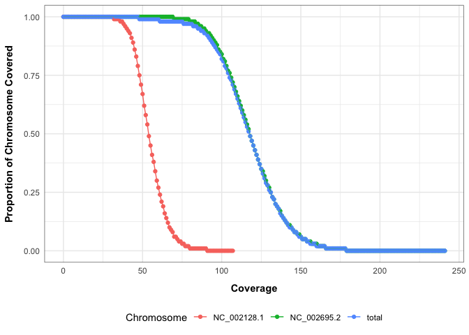

<!-- README.md is generated from README.Rmd. Please edit that file -->

# mosdepth

<!-- badges: start -->

[](https://lifecycle.r-lib.org/articles/stages.html#experimental)

<!-- badges: end -->

An R package api to help run mosdepth and parse/visualise mosdepth
output.

[**mosdepth**](https://github.com/brentp/mosdepth) is a commandline tool
that quickly and efficiently calculates coverage from bam file inputs.

## Installation

You can install the development version of mosdepth from
[GitHub](https://github.com/) with:

``` r
# install.packages("devtools")
devtools::install_github("selkamand/mosdepth")
```

## Visualising mosdepth output

We start by loading the library

``` r
library(mosdepth)
```

Then we point towards the mosdepth output directory

``` r
# Path to mosdepth output dir
mosdepth_dir = system.file("mosdepth_test_files", package="mosdepth")

# Create an object that keeps track of the output fils
mosdepth_output = mosdepth_collect_output_files(prefix = "E_coli", mosdepth_dir)

# Which output files do we have available? (not all options will produce the same set of files)
print(mosdepth_output)
#> summary ✔
#> global_distributions ✔
#> per_base_bed ✖
#> per_base_d4 ✔
#> regions_bed ✖
#> region_distributions ✖
#> quantized_bed ✖
#> thresholds_bed ✖
```

Next we can run any `mosdepth_plot_`, `mosdepth_tabulate_`, or
`mosdepth_calculate_` functions on this `mosdepth output` object. For
example we could plot cumulative coverage distributions

``` r
# Plot cumulative coverage distributions
mosdepth_plot_cumulative_coverage_distribution(mosdepth_output)
```



Or get a dataframe containing summary metrics

``` r
# Get summary table
mosdepth_tabulate_summary(mosdepth_output)
#>         chrom  length     bases   mean min max
#> 1 NC_002695.2 5498578 649591221 118.14   0 280
#> 2 NC_002128.1   92721   5033884  54.29  18 109
#> 3       total 5591299 654625105 117.08   0 280
```
